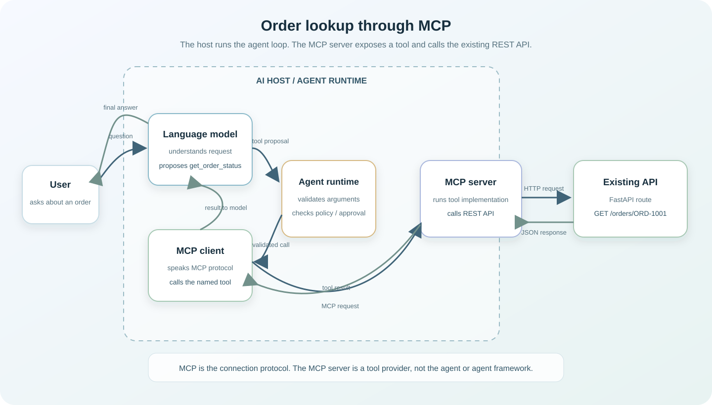

Suppose someone asks an AI assistant: **“What is the status of order ORD-1001?”** The answer is in your application, behind a REST API. How does the assistant discover the right operation, call it, and use the result?

This article follows that request from the user, through an AI host and its language model, to an MCP server and an existing FastAPI endpoint. It also clears up a common misunderstanding: **the MCP server is not the AI agent, and MCP is not an agent framework.**

## What is MCP?

The **Model Context Protocol (MCP)** is a standard way for an AI application to discover and use capabilities provided by another program. An MCP server can make tools, data, or reusable prompts available to an AI host. The host can connect to different servers through MCP instead of needing a separate custom integration for every service.

MCP is a protocol: it defines how the client and server exchange messages. It does not provide the language model, decide the agent’s goals, or define the application’s business rules. The AI host or agent runtime supplies the agent loop. Your service supplies the actual operation and enforces its permissions.

## The architecture: who does what?

Here is the whole order lookup. The solid arrows show a request moving toward the API; the return arrows show the result travelling back to the user.



| Part | What it is responsible for | In this example |
| --- | --- | --- |
| **User** | Asks for something in ordinary language | “What is the status of ORD-1001?” |
| **AI host / agent runtime** | Runs the agent loop, connects to the model and MCP clients, applies host policy, and handles user interaction | A chat app or IDE assistant |
| **Language model** | Interprets the request and proposes a tool call when it needs external information | Proposes `get_order_status` with `order_id="ORD-1001"` |
| **MCP client** | Lives inside the host and speaks MCP to one MCP server | Discovers and calls `get_order_status` |
| **MCP server** | Implements the tool, validates its input, and performs its backend work | Calls `GET /orders/ORD-1001` |
| **Existing REST API** | Applies application rules and reads the data | FastAPI returns the order status |

An AI host often has multiple MCP clients, one for each connected MCP server. The client is protocol plumbing inside the host; the server is a program that provides capabilities. Neither one is the language model.

### The important tool-call distinction

The language model **proposes** a tool call. It does not directly call your API and it does not get to execute arbitrary Python code. The host receives the proposal, checks that the tool exists and the arguments match its schema, applies its own policy or confirmation rules, and then asks the matching MCP client to make the MCP call.

The MCP server receives that call and runs the tool implementation. In our example, the implementation makes an ordinary HTTP request to the existing FastAPI service. The API response then travels back as the tool result. The host gives that result to the model, which can explain it to the user.

This is why MCP is not an agent framework. MCP describes how capabilities are exposed and called; the host decides when to ask the model, when to run a proposed tool, and how to continue the conversation.

## Request and response, step by step

1. The user asks about order `ORD-1001`.
2. The host sends the conversation and available tool descriptions to the language model.
3. The model proposes `get_order_status(order_id="ORD-1001")`.
4. The host validates the proposal and checks its policy. For a read-only lookup, it may allow the call; for a consequential write, it may require user approval.
5. The host’s MCP client sends the tool call to the MCP server over MCP.
6. The MCP server runs `get_order_status` and calls FastAPI’s `GET /orders/ORD-1001` endpoint.
7. FastAPI returns JSON. The MCP server returns that data as the tool result.
8. The host gives the result to the model, which answers the user in natural language.

## Example layout

We will run three pieces locally:

| Program | Local address | Job |
| --- | --- | --- |
| FastAPI REST API | `http://127.0.0.1:8000` | Owns order data and endpoint behaviour |
| MCP server | `http://127.0.0.1:8001/mcp` | Publishes the `get_order_status` tool and calls FastAPI |
| MCP client | Runs as a Python script | Connects to the MCP server and makes a tool call |

The client below is a small test client. In a real AI product, the equivalent MCP client is managed by the AI host, next to its agent runtime and language model.

## 1. Build the existing FastAPI REST API

Create `api.py`. This example uses an in-memory dictionary so you can run it without setting up a database. In a real app, the route would call your service or repository layer.

```python
from fastapi import FastAPI, HTTPException

app = FastAPI(title="Orders API")

ORDERS = {
    "ORD-1001": {"order_id": "ORD-1001", "status": "shipped"},
    "ORD-1002": {"order_id": "ORD-1002", "status": "processing"},
}


@app.get("/orders/{order_id}")
async def read_order(order_id: str):
    order = ORDERS.get(order_id)
    if order is None:
        raise HTTPException(status_code=404, detail="Order not found")
    return order
```

Install FastAPI and Uvicorn, the ASGI server used to run the app:

```bash
python -m pip install fastapi uvicorn
uvicorn api:app --reload --port 8000
```

Try the API directly at `http://127.0.0.1:8000/orders/ORD-1001`. It returns:

```json
{"order_id":"ORD-1001","status":"shipped"}
```

FastAPI has no MCP knowledge here. This is an ordinary REST endpoint that can still serve your website, mobile app, or other API clients.

## 2. Create an MCP server that wraps the API

Create `mcp_server.py`. The MCP server gives the operation a tool name and description the model can understand. Its implementation calls the existing REST endpoint with HTTPX.

Install the current MCP Python SDK and HTTPX:

```bash
python -m pip install "mcp[cli]>=2,<3" httpx
```

```python
import httpx
from mcp.server import MCPServer

mcp = MCPServer("Orders")
API_BASE_URL = "http://127.0.0.1:8000"


@mcp.tool()
async def get_order_status(order_id: str) -> dict:
    """Look up the current status of an order using its ID, for example ORD-1001."""
    try:
        async with httpx.AsyncClient(
            base_url=API_BASE_URL,
            timeout=10.0,
        ) as client:
            response = await client.get(f"/orders/{order_id}")
    except httpx.TimeoutException:
        return {"ok": False, "error": "The order service timed out. Please try again."}
    except httpx.RequestError:
        return {"ok": False, "error": "The order service could not be reached."}

    if response.status_code == 404:
        return {"ok": False, "error": f"No order was found with ID {order_id}."}

    response.raise_for_status()
    order = response.json()
    return {
        "ok": True,
        "order_id": order["order_id"],
        "status": order["status"],
    }


if __name__ == "__main__":
    mcp.run(transport="streamable-http", host="127.0.0.1", port=8001)
```

Start it in another terminal, leaving FastAPI running:

```bash
python mcp_server.py
```

The MCP endpoint is now `http://127.0.0.1:8001/mcp`. The MCP server is a separate process in this learning example. It is not the agent: it does not choose which tool to call or conduct the conversation. It implements the tool the host has asked it to run.

### What does the decorator do?

`@mcp.tool()` registers the Python function as a tool. The SDK uses its name, type hints, and docstring to describe it to the MCP client. Conceptually, the host learns something like:

| Tool field | Value |
| --- | --- |
| Name | `get_order_status` |
| Required input | `order_id`: string |
| Description | Look up the current status of an order using its ID |

That description helps the model decide whether the tool fits the request. A description is guidance, though; it is not a permission check. The server and API must still validate input and access.

## 3. Connect using an MCP client

Create `mcp_client.py`. This small script connects to the server, lists its available tools, calls `get_order_status`, and prints the result.

```python
import asyncio

from mcp import Client

MCP_URL = "http://127.0.0.1:8001/mcp"


async def main() -> None:
    async with Client(MCP_URL) as client:
        tools = await client.list_tools()
        print("Available tools:")
        for tool in tools.tools:
            print(f"- {tool.name}: {tool.description}")

        result = await client.call_tool(
            "get_order_status",
            {"order_id": "ORD-1001"},
        )
        print("\nTool result:")
        print(result.structured_content)


if __name__ == "__main__":
    asyncio.run(main())
```

Run it while both servers are running:

```bash
python mcp_client.py
```

This is MCP client code, but it is **not yet a full AI agent**: the script directly chooses the tool. A real host first gives the model the available tools, then handles the model’s proposal using an agent loop.

## 4. The AI agent loop

The protocol client and the model have different roles. The model-provider API differs between AI products, but the host-side loop follows this pattern:

1. **Discover:** The host’s MCP client calls `list_tools()` and gives the tool names, descriptions, and input schemas to the model.
2. **Propose:** The host sends the user’s request and available tools to the model. The model either replies directly or proposes a call such as `get_order_status` with `order_id="ORD-1001"`.
3. **Validate:** The host checks that the proposed tool exists and that its arguments match the tool’s schema. The host also applies its user and policy checks.
4. **Approve when needed:** The host can ask the user to confirm a sensitive or consequential action. A read-only order status lookup may not need extra confirmation, depending on the product’s policy.
5. **Execute through MCP:** Only after its checks does the host ask its MCP client to call the named tool with the arguments.
6. **Continue:** The MCP server’s result is added to the conversation. The host asks the model to continue; the model can then produce the final answer or propose another tool call.

This repeats until the model gives a final answer or the host stops the interaction. MCP covers the host-to-server capability exchange; the host handles the model integration and agent loop.

For our order question, the loop goes like this:

```text
Model proposes:       get_order_status(order_id="ORD-1001")
Host checks:          tool exists, argument is valid, user may access order
MCP client sends:     tools/call → MCP server
MCP server calls:     GET /orders/ORD-1001 → FastAPI
Tool result returns:  {"ok": true, "order_id": "ORD-1001", "status": "shipped"}
Model answers:        “Order ORD-1001 has shipped.”
```

The exact approval experience depends on the AI host. The important boundary is that a model-generated proposal is input to the host’s control flow, not an instruction that bypasses host policy.

## Common errors and how they move through the system

There are several links in this chain, so it helps to know which component reports a failure.

| Problem | Where it appears | A sensible response |
| --- | --- | --- |
| Order ID does not exist | FastAPI returns `404`; the MCP tool returns a safe not-found result | Tell the user no matching order was found |
| FastAPI is down or unreachable | HTTPX raises a request error | Return a short upstream-unavailable message; log technical detail on the server |
| FastAPI takes too long | HTTPX timeout | Return a retryable message and record a timeout metric |
| Model proposes an unknown tool or invalid arguments | Host validation | Reject the proposal; do not send it to the MCP server |
| MCP server URL or transport is wrong | MCP client connection/call | Check that the MCP server is running at the configured URL |
| User is not allowed to see the order | Host policy, MCP server, or API authorization | Deny access; do not return order data in an error message |

In production, also catch unexpected upstream `4xx` and `5xx` responses, log them with a request ID, and return a safe error to the model. Avoid returning tracebacks, internal URLs, database errors, or secrets as tool output.

## Permissions, authentication, and security

The local examples above are intentionally unauthenticated so the call flow is easy to see. Do **not** expose them publicly in this form. A secure deployment needs to protect each boundary that matters:

| Boundary | What to protect |
| --- | --- |
| AI host → MCP server | Authenticate remote clients, commonly with the deployment’s supported OAuth-based flow; use HTTPS |
| MCP server → FastAPI | Authenticate the service-to-service request with a managed credential or service identity |
| User → order data | Authorize the user for the specific order on the server side |
| Tool input → application | Validate IDs and allowed operations; apply limits and timeouts |
| Tool output → model | Return only the fields needed for the answer; never include credentials or unnecessary personal data |

Authentication answers **who is connecting**. Authorization answers **what that identity may do**. A tool description, a schema, or a model’s promise does not replace either one.

For example, knowing `ORD-1001` should not by itself grant access to that order. In a multi-user system, the authenticated user identity needs to reach the authorization check—through a trusted token or identity context—and the API should verify that the user is allowed to read it. Do not trust a user ID or permission claim supplied only as a tool argument.

Keep the tool narrow. `get_order_status` is safer and easier for a model to use than a generic tool such as “make any HTTP request.” For write operations such as cancelling an order, add authorization, clear confirmation behaviour in the host, careful retry handling, and audit logging.

## MCP versus REST APIs and agent frameworks

| Question | REST API | MCP | Agent framework / host |
| --- | --- | --- | --- |
| Main purpose | Expose application endpoints to software clients | Standardize how AI clients discover and call capabilities | Run the model, conversation, and tool-use loop |
| Example here | `GET /orders/ORD-1001` | `get_order_status(order_id="ORD-1001")` | Decide to ask the model, validate its proposal, call MCP, and continue |
| Does it choose tools? | No | No | Yes, based on model proposals and host policy |
| Does it contain business data? | Often, via application services | It may call into those services | Usually coordinates; it need not own the data |

MCP can sit in front of an existing API. It does not require replacing that API or rebuilding its business logic. An MCP server translates a carefully chosen capability into the protocol that an MCP client understands.

## Key takeaways

- The **model proposes** a tool call; the **host validates and authorizes** it before its MCP client sends the call.
- The **MCP server is a tool provider**, not the agent. It runs the tool and, in this example, calls the existing FastAPI API.
- **MCP is a protocol, not an agent framework.** The host or runtime owns the agent loop.
- A REST API and an MCP server can coexist: FastAPI remains the source of order data and business rules.
- Authentication, per-user authorization, validation, and safe error handling must be designed into the application.

## References

- [MCP architecture overview](https://modelcontextprotocol.io/docs/learn/architecture)
- [Official MCP Python SDK](https://github.com/modelcontextprotocol/python-sdk)
- [MCP Python SDK run guide](https://py.sdk.modelcontextprotocol.io/v2/run/)
- [FastAPI documentation](https://fastapi.tiangolo.com/)
